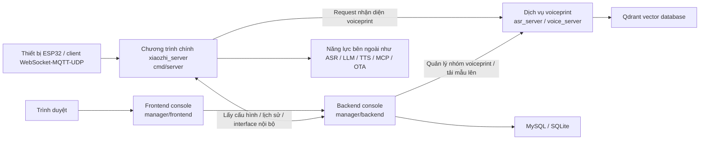

# Hướng dẫn biên dịch và triển khai

Tài liệu này dành cho developer cần biên dịch, debug và triển khai dự án từ source, tổng hợp cách biên dịch và triển khai chương trình chính, frontend/backend console và dịch vụ voiceprint.

Khuyến nghị đọc theo thứ tự sau:

- Xem kiến trúc tổng thể trước để hiểu vị trí và quan hệ gọi giữa từng service
- Sau đó lần lượt hoàn tất biên dịch và triển khai theo thứ tự “chương trình chính -> backend console -> frontend console -> dịch vụ voiceprint”
- Cuối cùng, nếu cần tạo gói phát hành tích hợp, hãy xem luồng đóng gói AIO ở cuối tài liệu

Tài liệu này ưu tiên mô tả cách biên dịch và triển khai tách rời từng service; dạng AIO được mô tả riêng ở phần sau.

## 1. Mô tả tách service

Khi phát triển hằng ngày, liên thông debug hoặc chỉ thay thế một service riêng lẻ, khuyến nghị dùng dạng triển khai tách rời:

- Chương trình chính: `cmd/server`
- Backend console: `manager/backend`
- Frontend console: `manager/frontend`
- Dịch vụ voiceprint: submodule `asr_server`

Bốn phần này được biên dịch và khởi động riêng, phù hợp nhất cho phát triển và debug.

Cách đóng gói AIO tích hợp nằm ở nửa sau tài liệu, phù hợp để tạo gói release hoặc gói bàn giao.

## 2. Kiến trúc tổng thể



### 2.1 Vị trí từng service trong kiến trúc

| Service | Thư mục code | Trách nhiệm chính | Cổng thường gặp |
| --- | --- | --- | --- |
| Chương trình chính | `cmd/server` | Kết nối thiết bị, điều phối session, gọi ASR/LLM/TTS, OTA, WebSocket/MQTT/UDP | `8989` / `2883` / `8990` |
| Backend console | `manager/backend` | API quản trị, quản lý cấu hình, lịch sử, quản lý nhóm voiceprint | `8080` |
| Frontend console | `manager/frontend` | Trang quản trị, wizard cấu hình, công cụ test | Dev `3000` |
| Dịch vụ voiceprint | `asr_server` | Đăng ký, nhận diện, xác minh voiceprint, interface streaming | Source mặc định `9000` |
| Embedded TTS/Piper | `tts_server/server` | Edge Offline và Piper/VITS offline, endpoint `/healthz`, `/piper/voices`, `/piper/tts` | Local compose host `19001`, nội bộ `main-server:9001` |

### 2.2 Quan hệ căn chỉnh địa chỉ quan trọng

Khi dùng Docker Compose local, container gọi nhau bằng hostname nội bộ như `main-server`, `backend`, `voice-server`, `mysql`; trình duyệt và curl từ máy host dùng `localhost` kèm port map như `18080`, `28080`, `18989`, `19001`.

Khi triển khai tách rời, bốn địa chỉ dưới đây nhất định phải khớp:

| Hướng gọi | Mục cấu hình | Giá trị điển hình |
| --- | --- | --- |
| Frontend -> Backend | `VITE_API_TARGET` | `http://127.0.0.1:8080` |
| Chương trình chính -> Backend console | `config/config.yaml` -> `manager.backend_url` | `http://127.0.0.1:8080` |
| Backend console -> Dịch vụ voiceprint | `manager/backend/config/config.json` -> `speaker_service.url` hoặc `SPEAKER_SERVICE_URL` | `http://127.0.0.1:9000` |
| Chương trình chính -> Dịch vụ voiceprint | `config/config.yaml` -> `voice_identify.base_url` | `http://127.0.0.1:9000` |

### 2.3 Health check không cần thiết bị ESP32

Với stack local, có thể kiểm tra phần server trước khi có thiết bị thật:

```bash
curl http://localhost:19001/healthz
curl http://localhost:19001/piper/voices
```

Trong console web, Dashboard admin có Health Check tổng hợp để xem nhanh backend, database, main-server/TTS, Piper voices, ASR và readiness cấu hình.

## 3. Chuẩn bị môi trường

### 3.1 Kéo code và submodule

Dịch vụ voiceprint là Git submodule, sau lần kéo đầu tiên hãy chạy:

```bash
git submodule update --init --recursive
```

Nếu clone repo mới, khuyến nghị dùng trực tiếp:

```bash
git clone --recursive <repo-url>
```

### 3.2 Phiên bản công cụ khuyến nghị

- Go: `1.24.x`, giữ nhất quán với `1.24.4` trong CI
- Node.js: `20.x`
- npm: đi kèm Node 20

### 3.3 Dependency chung khi biên dịch local trên Linux

Chương trình chính và dịch vụ voiceprint đều liên quan đến CGO, ONNX Runtime hoặc thư viện động ten-vad. Với Ubuntu có thể tham khảo:

```bash
sudo apt-get update
sudo apt-get install -y pkg-config libopus0 libopusfile-dev libc++1 libc++abi1
```

Biên dịch source local của chương trình chính còn cần cài ONNX Runtime 1.21.0; có thể tham khảo trực tiếp mục “biên dịch local” trong `README.md` ở root repo.

### 3.4 Hạ tầng nên chuẩn bị trước

- MySQL: cần khi backend console dùng MySQL
- Qdrant: cần khi dịch vụ voiceprint dùng `qdrant` để lưu trữ

Nếu chỉ xác minh chức năng local:

- Backend console có thể dùng SQLite trước
- Dịch vụ voiceprint có thể dùng lưu trữ JSON trước

## 4. Triển khai tách rời: biên dịch và triển khai từng service

### 4.1 Chương trình chính

Thư mục code: `cmd/server`

### Cấu hình quan trọng

Vị trí file cấu hình mặc định:

```text
config/config.yaml
```

Khi triển khai source, các mục thường sửa nhất là:

- `manager.backend_url`
- `websocket.host` / `websocket.port`
- `mqtt_server.listen_port`
- `udp.listen_port`
- `voice_identify.enable`
- `voice_identify.base_url`

Nếu dùng triển khai tách rời, khuyến nghị chỉnh đúng hai mục sau trước:

```yaml
manager:
  backend_url: "http://127.0.0.1:8080"

voice_identify:
  enable: true
  base_url: "http://127.0.0.1:9000"
```

### Biên dịch

```bash
go mod tidy
go build -o xiaozhi_server ./cmd/server
```

### Khởi động

```bash
./xiaozhi_server -c config/config.yaml
```

### Khuyến nghị triển khai

1. Ở chế độ triển khai tách rời, bản thân chương trình chính không quản lý process của frontend/backend console và dịch vụ voiceprint.
2. Trước khi khởi động chương trình chính, khuyến nghị backend console đã truy cập được; nếu không, provider cấu hình `manager` sẽ lỗi khi kéo cấu hình.
3. Nếu thiết bị dùng WebSocket, địa chỉ truy cập cốt lõi thường là `ws://<host>:8989/xiaozhi/v1/`.

### 4.2 Backend console

Thư mục code: `manager/backend`

### Cấu hình quan trọng

Vị trí file cấu hình mặc định:

```text
manager/backend/config/config.json
```

Cần chú ý:

- `database.type`: `mysql` hoặc `sqlite`
- `database.mysql` / `database.sqlite`
- `speaker_service.url`
- `history.audio_base_path`

Biến môi trường hỗ trợ ghi đè:

- `DB_HOST`
- `DB_PORT`
- `DB_USER`
- `DB_PASSWORD`
- `DB_NAME`
- `SPEAKER_SERVICE_URL`
- `AUDIO_BASE_PATH`

### Biên dịch

```bash
cd manager/backend
go mod tidy
go build -o main .
```

### Khởi động

```bash
cd manager/backend
./main -c config/config.json
```

Ở chế độ dev cũng có thể chạy trực tiếp:

```bash
cd manager/backend
go run main.go -c config/config.json
```

### Khuyến nghị triển khai

1. Debug local ưu tiên dùng SQLite để giảm dependency.
2. Khi liên thông chức năng voiceprint, hãy đảm bảo `speaker_service.url` đã trỏ tới dịch vụ voiceprint.
3. Sau khi backend console khởi động, chương trình chính và frontend đều nên trỏ tới service này.

### 4.3 Frontend console

Thư mục code: `manager/frontend`

Frontend console chủ yếu dùng để phát triển liên thông local. Cài dependency rồi khởi động dev server:

```bash
cd manager/frontend
npm ci
npm run dev
```

Địa chỉ dev mặc định:

- Trang frontend: `http://127.0.0.1:3000`
- API proxy target: `http://127.0.0.1:8080`

Nếu cần sửa proxy target, có thể đặt:

```bash
VITE_API_TARGET=http://127.0.0.1:8080
```

Hoặc sửa `manager/frontend/.env`.

### 4.4 Dịch vụ voiceprint

Thư mục code: `asr_server`

### Ghi chú quan trọng

`asr_server` là submodule. Khi chạy source riêng, mặc định đọc:

```text
asr_server/config.json
```

Cổng mặc định trong cấu hình submodule hiện tại là `9000`. Khi triển khai thực tế, bắt buộc giữ nhất quán với địa chỉ dịch vụ voiceprint trong chương trình chính và backend console.

### Cấu hình quan trọng

Cần chú ý:

- `server.port`
- `speaker.enabled`
- `speaker.storage_type`
- `speaker.qdrant.host`
- `speaker.qdrant.port`
- `speaker.qdrant.collection_name`
- `speaker.model_path`

Lựa chọn thường gặp:

1. Liên thông dev: `speaker.storage_type = "json"`
2. Triển khai production: `speaker.storage_type = "qdrant"`

### Biên dịch source

Linux / macOS:

```bash
cd asr_server
go mod tidy
CGO_ENABLED=1 go build -o voice_server main.go
```

Windows PowerShell:

```powershell
cd asr_server
$env:CGO_ENABLED=1
go mod tidy
go build -o voice_server.exe main.go
```

### Khởi động

Linux / macOS:

```bash
cd asr_server
export LD_LIBRARY_PATH="$PWD/lib:$PWD/lib/ten-vad/lib/Linux/x64:${LD_LIBRARY_PATH:-}"
./voice_server
```

Windows:

```powershell
cd asr_server
.\voice_server.exe
```

### Khuyến nghị triển khai

1. Phát triển local nên dùng lưu trữ JSON để chạy thông interface trước, sau đó mới chuyển sang Qdrant.
2. Nếu chương trình chính bật `voice_identify.enable=true`, hãy sửa đồng bộ `voice_identify.base_url` trong chương trình chính.
3. `speaker_service.url` của backend console cũng phải trỏ tới cùng địa chỉ dịch vụ voiceprint.

### 4.5 Thứ tự khởi động khuyến nghị

Tài liệu này mô tả theo thứ tự “chương trình chính -> backend console -> frontend console -> dịch vụ voiceprint”, nhưng khi khởi động thực tế nên theo thứ tự dependency:

1. MySQL / SQLite
2. Qdrant
3. Dịch vụ voiceprint `asr_server`
4. Backend console `manager/backend`
5. Chương trình chính `cmd/server`
6. Frontend console `manager/frontend`

## 5. Luồng đóng gói AIO nhất quán với Release

Nếu mục tiêu là tái tạo gói phát hành hiện tại của repo thay vì triển khai tách rời, khuyến nghị thực hiện theo hướng CI.

Trước khi đóng gói AIO, hãy đảm bảo bạn đã hiểu và chạy thông luồng triển khai tách rời trong chương 4.

Dạng AIO của repo hiện tại sẽ build frontend trước, sau đó dùng Go build tags để đưa các năng lực sau vào chương trình chính:

- `manager`
- `asr_server`
- `embed_ui`

Vì vậy, artifact cuối cùng `xiaozhi_server` thực tế là “chương trình chính + backend console + dịch vụ voiceprint + frontend console đã embed”.

### 5.1 Biên dịch frontend trước

```bash
cd manager/frontend
npm ci
npm run build
```

Sau đó copy artifact frontend vào thư mục static của backend:

```bash
mkdir -p ../backend/static/dist
cp -r dist/* ../backend/static/dist/
```

### 5.2 Biên dịch chương trình chính có service embed

Quay lại root repo và chạy:

```bash
go mod tidy
go build -tags "nolibopusfile asr_server manager embed_ui" -ldflags "-s -w" -o xiaozhi_server ./cmd/server
```

### 5.3 Khởi động gói AIO

Khi CI đóng gói, các file sau sẽ được đặt cùng thư mục release:

- `main_config.yaml`
- `manager.json`
- `asr_server.json`
- `models/`
- `data/`

Khi chạy thủ công local, có thể tham khảo:

```bash
./xiaozhi_server \
  -c main_config.yaml \
  -manager-config manager.json \
  -asr-config asr_server.json
```

### 5.4 Ghi chú bổ sung về đóng gói AIO

Khi phát hành thực tế, thường cần làm thêm:

- Đóng gói runtime library của ten-vad / sherpa-onnx
- Copy `models/`, `data/`, cấu hình mẫu
- Đổi tên và nén thư mục theo nền tảng

## 6. Hướng dẫn sử dụng đơn giản sau khi triển khai xong

### 6.1 Mở console

Sau khi triển khai xong, truy cập bằng trình duyệt:

```text
http://<IP hoặc domain server>:8080
```

Nếu frontend/backend tách rời và chưa có reverse proxy thống nhất, hãy truy cập theo cổng phát hành frontend của bạn.

### 6.2 Hoàn tất cấu hình cơ bản

Lần đầu vào, khuyến nghị hoàn tất theo wizard cấu hình trong console:

1. Địa chỉ OTA
2. Cấu hình VAD
3. Cấu hình ASR
4. Cấu hình LLM
5. Cấu hình TTS

### 6.3 Xác minh dịch vụ voiceprint

Nếu cần nhận diện voiceprint:

1. Tạo nhóm voiceprint trong console
2. Tải audio mẫu lên
3. Xác nhận backend console truy cập được dịch vụ voiceprint
4. Xác nhận `voice_identify.enable=true` của chương trình chính
5. Xác nhận `voice_identify.base_url` của chương trình chính trỏ đúng địa chỉ

### 6.4 Kết nối thiết bị

Thông tin truy cập thiết bị thường gặp:

- WebSocket: `ws://<host>:8989/xiaozhi/v1/`
- Interface OTA: `http://<host>:8989/xiaozhi/ota/`
- MQTT: `<host>:2883`
- UDP: `<host>:8990`

### 6.5 Vòng liên thông tối thiểu

Khuyến nghị smoke test theo thứ tự sau:

1. Mở console và xác nhận trang tải được.
2. Hoàn tất một bộ cấu hình VAD / ASR / LLM / TTS khả dụng trong console.
3. Xác nhận log chương trình chính đã kéo cấu hình console thành công.
4. Nếu bật voiceprint, tải mẫu lên trong console trước rồi test nhận diện.
5. Cho thiết bị lấy địa chỉ WebSocket hoặc MQTT/UDP qua OTA và kết nối vào chương trình chính.

## 7. Lỗi thường gặp

### 7.1 Địa chỉ dịch vụ voiceprint không nhất quán

Vấn đề thường gặp nhất là hai địa chỉ sau không được sửa đồng thời:

- `manager/backend/config/config.json` -> `speaker_service.url`
- `config/config.yaml` -> `voice_identify.base_url`

### 7.2 Quên khởi tạo submodule

Nếu `asr_server/server/setup.go` không tồn tại, nghĩa là submodule chưa được kéo xuống; biên dịch AIO và biên dịch Release đều sẽ thất bại.

### 7.3 Dùng lẫn “triển khai tách rời” và “gói AIO”

Hãy nhớ:

- Triển khai tách rời: bốn service build riêng, chạy riêng
- Đóng gói AIO: frontend, backend và dịch vụ voiceprint được biên dịch chung vào `xiaozhi_server`

Hãy xác định hình thái mục tiêu trước, rồi mới quyết định lệnh build và file cấu hình.
