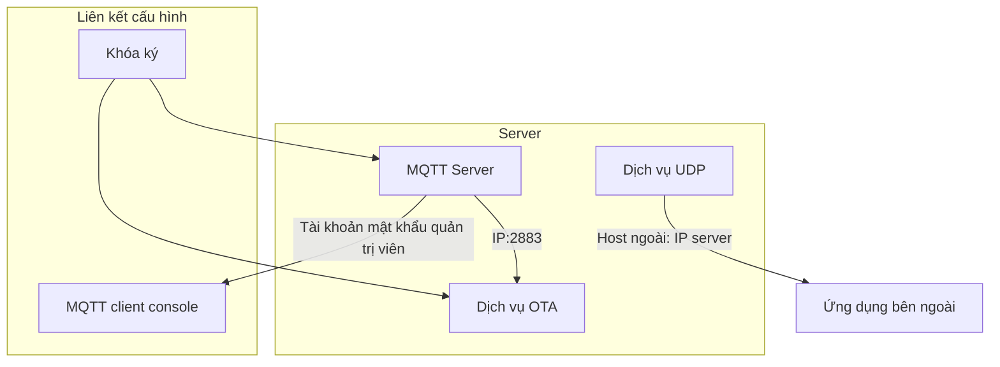
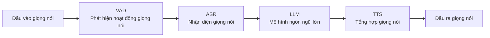

# Hướng dẫn triển khai và sử dụng backend Xiaozhi AI cho ESP32

Hướng dẫn này cung cấp quy trình triển khai đầy đủ khi dùng dự án này làm backend cho ESP32, gồm ba phần chính: triển khai server, cấu hình thiết bị và cấu hình console.

## 1. Triển khai server

Có hai cách triển khai server: triển khai trên máy local hoặc triển khai bằng Docker.

### Triển khai Docker

Bạn có thể triển khai Docker theo hai cách sau:

* **Cách 1 (khuyến nghị - bao gồm console)**: [Quickstart Docker Compose »](doc/docker_compose.md)
* **Cách 2 (chỉ service, không có console)**: [Quickstart Docker »](doc/docker.md)

**Lưu ý quan trọng:**

* Lệnh `docker-compose` là công cụ độc lập với Docker Engine. Nếu bạn dùng phiên bản Docker mới hơn, cũng có thể dùng trực tiếp lệnh `docker compose` (một subcommand của `docker` CLI); hai cách có chức năng tương đương.

**Mô tả ánh xạ cổng dịch vụ:**

Sau khi triển khai, cổng dịch vụ trong container sẽ được ánh xạ ra host, cấu hình mặc định như sau:

* **`8989:8989`**: cổng dịch vụ WebSocket.
* **`2883:2883`**: cổng dịch vụ MQTT.
* **`8888:8888/udp`**: cổng dịch vụ UDP.

### Triển khai local

Tham khảo `README.md`.

## 2. Cấu hình địa chỉ cập nhật OTA cho ESP32

Thiết bị ESP32 hỗ trợ hai cách cấu hình địa chỉ OTA server:

### Cách 1: sửa qua cấu hình WiFi (phù hợp sau khi thiết bị đã triển khai)

Cách này cần sửa thông qua giao diện Web cấu hình mạng của thiết bị.

**Các bước thao tác:**

1. Khởi động thiết bị ESP32 để thiết bị vào chế độ cấu hình WiFi (thường là mở một hotspot AP).
2. Dùng điện thoại hoặc máy tính kết nối tới hotspot này, rồi mở trang cấu hình trong trình duyệt (địa chỉ thường là `192.168.4.1`).
3. Tìm mục liên quan đến **OTA** trên trang.
4. Sửa địa chỉ OTA server thành: `http://<IP server của bạn>:8989/xiaozhi/ota/`
   **Ví dụ**: `http://192.168.1.12:8989/xiaozhi/ota/`
5. Lưu cấu hình và hoàn tất cấu hình mạng.

### Cách 2: sửa qua cấu hình biên dịch

Cách này cần biên dịch lại firmware ESP32 và sửa file cấu hình dự án để đặt sẵn địa chỉ OTA.

**Các bước thao tác:**

1. Trong thư mục dự án ESP32 của bạn, tìm vị trí tương ứng của file cấu hình `config.json`.
2. Thêm hoặc sửa mục cấu hình địa chỉ OTA server:
   ```json
   "CONFIG_OTA_URL": "http://<IP server của bạn>/xiaozhi/ota/"
   ```

## 3. Cấu hình console

### Cấu hình dịch vụ



#### Cấu hình OTA

Sửa khóa ký cho nhất quán với “khóa ký” trong trang cấu hình mqtt server.
Có thể chọn bật cấu hình MQTT hay không; nếu bật, endpoint MQTT đặt là IP server:2883.

#### Cấu hình MQTT

Nếu dùng MQTT broker tích hợp, sửa địa chỉ Broker thành `127.0.0.1`, cổng thành `2883`.
Nếu dùng MQTT bên ngoài, hãy sửa theo nhu cầu.
Sửa cấu hình xác thực thành tài khoản và mật khẩu quản trị viên trong cấu hình MQTT Server.

#### Cấu hình MQTT Server

Đặt cổng lắng nghe là `2883`.
Đặt tài khoản và mật khẩu quản trị viên.
Đặt khóa ký nhất quán với khóa ký trong trang cấu hình ota.

#### Cấu hình UDP

Đặt cổng lắng nghe là `8888`.
Đặt host ngoài thành IP server của bạn, ví dụ `192.168.1.12`.

#### Cấu hình MCP

MCP server toàn cục là MCP server bên ngoài; nếu chưa có MCP server bên ngoài thì có thể tạm thời không cấu hình.

### Cấu hình AI



#### Cấu hình VAD

Dùng WebRTC VAD, không cần cấu hình bên ngoài.

#### Cấu hình ASR

Điền cấu hình ASR. Ngay cả khi server triển khai bằng Docker và không triển khai ASR cục bộ, bạn vẫn có thể triển khai thủ công.
Hướng dẫn triển khai tham khảo [FunASR realtime speech dictation service development guide](https://github.com/modelscope/FunASR/blob/main/runtime/docs/SDK_advanced_guide_online_zh.md).

#### Cấu hình LLM

Điền APIKEY của bạn.

#### Cấu hình TTS

Lưu ý: Xiaozhi TTS hiện không còn hoạt động bình thường, khuyến nghị dùng edge.
