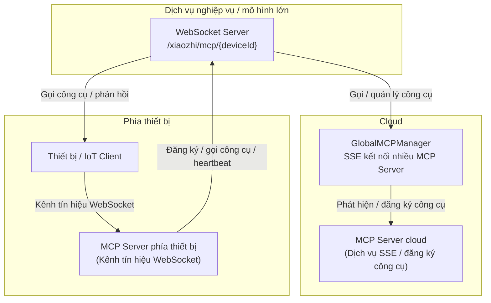

# Tài liệu chức năng và logic MCP

## 1. Tổng quan

MCP (Model Context Protocol) là giao thức quản lý và gọi công cụ tổng quát được triển khai dựa trên [Eino framework](https://github.com/cloudwego/eino). MCP hỗ trợ đăng ký, phát hiện và gọi công cụ ở cấp toàn cục và cấp thiết bị, thường dùng trong hội thoại AI, IoT và các kịch bản tương tự.

## 2. Tính năng

### Quản lý công cụ MCP toàn cục

- Hỗ trợ kết nối nhiều MCP server qua SSE để tự động phát hiện và đăng ký công cụ.
- Proxy gọi công cụ với interface thống nhất.
- Theo dõi trạng thái kết nối và tự động kết nối lại.

### Quản lý MCP theo thiết bị

- Mỗi thiết bị có kết nối MCP độc lập, hỗ trợ giao thức WebSocket.
- Đăng ký và quản lý công cụ riêng theo thiết bị.
- Giới hạn số kết nối và tự động dọn dẹp.

### Tích hợp Eino framework

- Triển khai interface `tool.InvokableTool`, hỗ trợ gọi công cụ native của Eino.
- An toàn kiểu dữ liệu và hỗ trợ xử lý streaming.

## 3. Thiết kế kiến trúc



## 4. Mô tả cấu hình

### Ví dụ `config.yaml`

```yaml
mcp:
  global:
    enabled: true
    servers:
      - name: "filesystem"
        sse_url: "http://localhost:3001/sse"
        enabled: true
    reconnect_interval: 5
    max_reconnect_attempts: 10
  device:
    enabled: true
    websocket_path: "/xiaozhi/mcp/"
    max_connections_per_device: 5
```

### Mô tả tham số

| Tham số | Kiểu | Mô tả |
|------|------|------|
| mcp.global.enabled | bool | Có bật manager MCP toàn cục hay không |
| mcp.global.servers | array | Danh sách MCP server |
| mcp.global.reconnect_interval | int | Khoảng thời gian reconnect, tính bằng giây |
| mcp.global.max_reconnect_attempts | int | Số lần reconnect tối đa |
| mcp.device.enabled | bool | Có bật manager MCP theo thiết bị hay không |
| mcp.device.websocket_path | string | Prefix đường dẫn WebSocket |
| mcp.device.max_connections_per_device | int | Số kết nối tối đa cho mỗi thiết bị |

## 5. API interface

### WebSocket endpoint

- Kết nối MCP của thiết bị:
  - `ws://<host>:<port>/xiaozhi/mcp/{deviceId}`
  - Sau khi kết nối, server gửi message khởi tạo; client phản hồi danh sách công cụ để thiết lập giao tiếp hai chiều.

- Ví dụ định dạng message:

```json
{
  "jsonrpc": "2.0",
  "method": "tools/list",
  "id": 1,
  "params": {}
}
```

### REST interface

- Lấy danh sách công cụ của thiết bị:
  - `GET /xiaozhi/api/mcp/tools/{deviceId}`
  - Ví dụ response:

```json
{
  "deviceId": "device123",
  "tools": {
    "filesystem_read_file": { "name": "read_file", "description": "Đọc nội dung file", "type": "global" },
    "device_sensor_data": { "name": "sensor_data", "description": "Lấy dữ liệu cảm biến", "type": "device" }
  },
  "globalCount": 5,
  "deviceCount": 3,
  "totalCount": 8,
  "timestamp": 1704067200
}
```

## 6. Ví dụ sử dụng điển hình

### Gọi từ Go

```go
// Lấy công cụ toàn cục.
manager := mcp.GetGlobalMCPManager()
tools := manager.GetAllTools()
for name, tool := range tools {
    result, err := tool.InvokableRun(context.Background(), `{"path": "/tmp/test.txt"}`)
    if err != nil {
        log.Errorf("Gọi công cụ thất bại: %v", err)
        continue
    }
    log.Infof("Kết quả công cụ %s: %s", name, result)
}
```

### Kết nối WebSocket phía thiết bị bằng JavaScript

```javascript
const ws = new WebSocket('ws://localhost:8989/xiaozhi/mcp/device123');
ws.onopen = function() { console.log('Kết nối MCP đã được thiết lập'); };
ws.onmessage = function(event) {
    const message = JSON.parse(event.data);
    if (message.method === 'initialize') {
        ws.send(JSON.stringify({
            jsonrpc: "2.0",
            id: message.id,
            result: {
                protocolVersion: "2024-11-05",
                serverInfo: { name: "device-mcp-server", version: "1.0.0" }
            }
        }));
    }
};
```

## 7. Điểm chính trong triển khai kỹ thuật

- Manager MCP toàn cục kết nối tới nhiều MCP server qua SSE, tự động phát hiện và đăng ký công cụ, hỗ trợ reconnect và kiểm tra sức khỏe.
- Manager MCP theo thiết bị duy trì kết nối độc lập cho từng thiết bị, hỗ trợ WebSocket và giao thức IoT, tự động dọn dẹp thiết bị offline.
- Công cụ đều triển khai interface `InvokableTool`, hỗ trợ kiểm tra tham số, retry khi gọi và format kết quả.
- Khi tích hợp LLM, hệ thống tự động lấy toàn bộ công cụ MCP và truyền cho mô hình lớn, hỗ trợ phản hồi streaming và vòng gọi công cụ khép kín.
- Xử lý lỗi đầy đủ, hỗ trợ fallback, truy vết log và đảm bảo tương thích.

## 8. Gợi ý xử lý lỗi và tối ưu

- Kiểm tra trạng thái kết nối SSE/WebSocket, chú ý lỗi kết nối, đăng ký và gọi công cụ trong log.
- Khi gọi công cụ thất bại, kiểm tra format tham số và trạng thái đăng ký công cụ.
- Cấu hình hợp lý khoảng reconnect, số kết nối tối đa và dọn dẹp định kỳ session không còn hiệu lực.
- Có thể mở rộng kiểm soát quyền, bật/tắt công cụ động và trả kết quả ngược về thiết bị.

## 9. Tài liệu tham khảo

- [Tài liệu Eino framework](https://www.cloudwego.io/docs/eino/)
- [Đặc tả giao thức MCP](https://github.com/mark3labs/mcp-go)
- [Đặc tả SSE](https://developer.mozilla.org/en-US/docs/Web/API/Server-sent_events)
- [Giao thức WebSocket](https://tools.ietf.org/html/rfc6455)

## 10. MCP phía thiết bị qua kênh tín hiệu WebSocket

MCP phía thiết bị thiết lập kết nối với server qua kênh tín hiệu WebSocket để đăng ký công cụ cấp thiết bị, gọi công cụ và quản lý session. Cơ chế này phù hợp cho thiết bị edge và kịch bản IoT.

### Luồng điển hình

1. Thiết bị tạo kết nối WebSocket qua `ws://<host>:<port>/xiaozhi/mcp/{deviceId}`.
2. Sau khi server nhận kết nối, server tạo hoặc lấy session MCP tương ứng với thiết bị (`DeviceMcpSession`) và khởi tạo MCP client instance.
3. Server gửi message khởi tạo qua kênh tín hiệu; thiết bị phản hồi và có thể đồng bộ danh sách công cụ.
4. Hai phía dùng giao thức JSON-RPC để gọi công cụ, gửi notification, heartbeat và các tương tác khác.
5. Khi kết nối ngắt hoặc timeout, session và tài nguyên sẽ được tự động dọn dẹp.

### Interface chính và định dạng message

- Endpoint kết nối: `ws://<host>:<port>/xiaozhi/mcp/{deviceId}`
- Message khởi tạo:

```json
{
  "jsonrpc": "2.0",
  "method": "initialize",
  "id": 1,
  "params": {}
}
```

- Request danh sách công cụ:

```json
{
  "jsonrpc": "2.0",
  "method": "tools/list",
  "id": 2,
  "params": {}
}
```

- Request/response gọi công cụ và notification đều tuân theo đặc tả JSON-RPC 2.0.

### Quản lý session và kết nối

- Mỗi ID thiết bị duy trì một `DeviceMcpSession` độc lập, hỗ trợ nhiều kiểu kết nối MCP như WebSocket và IoT.
- Hỗ trợ giới hạn số kết nối tối đa, heartbeat định kỳ bằng ping, tự động phát hiện mất kết nối và dọn dẹp.
- Khi ngắt kết nối, hệ thống tự động giải phóng tài nguyên để đảm bảo ổn định.

### Heartbeat và xử lý mất kết nối

- Thiết bị và server định kỳ gửi message ping để kiểm tra kết nối còn sống.
- Nếu quá 2 phút không có heartbeat, thiết bị được xem là offline; kết nối sẽ tự động bị ngắt và session được dọn dẹp.

### Phối hợp thiết bị và cloud

- MCP phía thiết bị phù hợp để đăng ký công cụ cục bộ, thu thập dữ liệu realtime và chạy suy luận AI ở edge.
- MCP cloud chịu trách nhiệm đăng ký công cụ toàn cục, tổng hợp năng lực xuyên thiết bị và điều phối thống nhất.
- Hai phía có thể phối hợp để cung cấp năng lực gọi công cụ phong phú cho mô hình lớn hoặc hệ thống nghiệp vụ.
