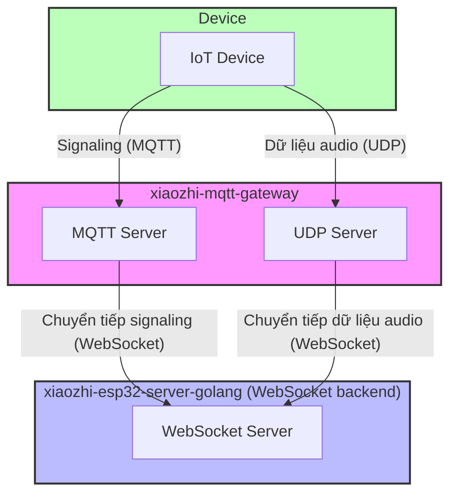

# Hướng dẫn cấu hình MQTT UDP Bridge

---

### Giải thích thuật ngữ

- **xiaozhi-mqtt-gateway:** dự án MQTT UDP Bridge chính thức của Xiage, dùng để chuyển đổi giao thức MQTT và UDP sang WebSocket. Service này cho phép thiết bị truyền control message qua MQTT, đồng thời truyền dữ liệu audio hiệu quả qua UDP, rồi bridge các dữ liệu đó tới WebSocket service. [xiaozhi-mqtt-gateway](https://github.com/78/xiaozhi-mqtt-gateway)
- **xiaozhi-esp32-server-golang:** dự án hiện tại

### Kiến trúc tổng thể



## 1. Hướng dẫn cấu hình MQTT UDP Bridge

### Các bước cài đặt

---

1. Clone repo

```bash
git clone 'https://github.com/78/xiaozhi-mqtt-gateway'
cd xiaozhi-mqtt-gateway
```

2. Cài dependency

```bash
npm install
```

3. Tạo file cấu hình

```bash
mkdir -p config
cp config/mqtt.json.example config/mqtt.json
```

4. Sửa file cấu hình `config/mqtt.json` và thiết lập tham số phù hợp

### Mô tả cấu hình

File cấu hình `config/mqtt.json` cần chứa nội dung sau:

- `chat_servers`: điền IP và cổng của Xiaozhi Golang server, ***path bắt buộc là /xiaozhi/mqtt_udp/v1/***

```json
{
  "debug": false,
  "development": {
    "mac_addresss": ["aa:bb:cc:dd:ee:ff"],
    "chat_servers": ["ws://192.168.0.100:8989/xiaozhi/mqtt_udp/v1/"]
  },
  "production": {
    "chat_servers": ["ws://192.168.0.100:8989/xiaozhi/mqtt_udp/v1/"]
  }
}
```

### Biến môi trường

Tạo file `.env` và thiết lập các biến môi trường sau:

```dotenv
MQTT_PORT=1883              # Cổng MQTT server
UDP_PORT=8884               # Cổng UDP server
PUBLIC_IP=192.168.0.100     # IP public của server

#MQTT_SIGNATURE_KEY=mqtt_key # mqtt key, tùy chọn; nếu cấu hình thì bật xác thực MQTT, cần giống key cấu hình trong WebSocket server
```

### Chạy

##### Môi trường development

```bash
# Chạy trực tiếp
node app.js

# Chạy ở chế độ debug
DEBUG=mqtt-server node app.js
```

---

## 2. Hướng dẫn cấu hình backend Xiaozhi Golang

### 1. Mô tả các mục cấu hình quan trọng

#### Tắt MQTT và UDP server local

```yaml
mqtt:
  enable: false
  broker: "127.0.0.1"
  type: "tcp"
  port: 2883
  client_id: "xiaozhi_server"
  username: "admin"
  password: "test!@#"
```

#### Cấu hình OTA (thiết bị lấy tham số kết nối qua OTA)

- `ota.signature_key`: cần giống ***MQTT_SIGNATURE_KEY*** trong file `.env` của `xiaozhi-mqtt-bridge`
- `test` / `external`: phân biệt môi trường mạng nội bộ và bên ngoài
- `websocket.url`: địa chỉ WebSocket service được trả về
- `mqtt.endpoint`: địa chỉ và cổng MQTT service
- `mqtt.enable`: có bật MQTT hay không; khi là `true`, thiết bị ưu tiên dùng MQTT + UDP

```yaml
ota:
  signature_key: "mqtt_key"
  test:
    websocket:
      url: "ws://192.168.208.214:8989/xiaozhi/v1/"
    mqtt:
      enable: true
      endpoint: "192.168.208.214:5883"
  external:
    websocket:
      url: "wss://www.tb263.cn:55555/go_ws/xiaozhi/v1/"
    mqtt:
      enable: true
      endpoint: "mqtt.youdomain.cn"
```

---

## 3. Tài liệu tham khảo

- [mqtt_udp.md](./mqtt_udp.md) (kiến trúc, cấu hình và luồng chi tiết)
- [mqtt_udp_protocol.md](./mqtt_udp_protocol.md) (giao thức và luồng dữ liệu)
- [config.md](./config.md) (mô tả chi tiết các mục cấu hình)
