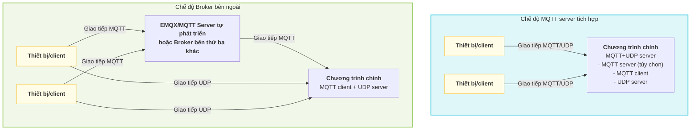

# Quy trình cấu hình MQTT UDP server

Dự án này triển khai **MQTT+UDP server riêng**, dùng để xử lý hiệu quả việc truyền dữ liệu như audio giữa thiết bị và server. Kiến trúc linh hoạt, hỗ trợ nhiều cách triển khai và thay thế, phù hợp với nhiều kịch bản nghiệp vụ.

## 1. Đặc điểm kiến trúc và tính linh hoạt

- **MQTT+UDP server tự phát triển**: dự án tích hợp đầy đủ MQTT protocol server và kênh audio UDP, hỗ trợ thiết bị thiết lập session qua MQTT, dữ liệu tiếp theo đi qua UDP, cân bằng giữa độ tin cậy và realtime.
- **Cách triển khai MQTT server tùy chọn**:
  - Có thể khởi động cùng process chính như một phần của chương trình chính (server), phù hợp triển khai tích hợp.
  - Cũng có thể triển khai riêng thành process độc lập, tiện mở rộng ngang và cô lập tài nguyên.
- **Hỗ trợ MQTT server bên thứ ba**:
  - Kiến trúc dự án hỗ trợ thay thế MQTT server tích hợp bằng Broker bên thứ ba như EMQX hoặc MQTT Server tự phát triển.
  - Chỉ cần điều chỉnh tham số liên quan đến `mqtt` trong file cấu hình, chương trình chính có thể kết nối external Broker như một client thuần, phù hợp với cluster quy mô lớn và kịch bản high availability.
- **Hỗ trợ tích hợp dự án chính thức xiaozhi-mqtt-gateway**
  - Đã thích ứng với dự án open source xiaozhi-mqtt-gateway, có thể kết nối sử dụng
  - [Xem chi tiết mqtt_bridge.md](./mqtt_bridge.md)

### Sơ đồ kiến trúc triển khai

Sơ đồ dưới đây thể hiện hai cách triển khai điển hình, giúp hiểu kiến trúc linh hoạt của dự án:



**Mô tả:**
- <b>Chế độ MQTT server tích hợp</b>: chương trình chính tích hợp MQTT server và UDP server, thiết bị giao tiếp trực tiếp với chương trình chính.
- <b>Chế độ Broker bên ngoài</b>: chương trình chính chỉ đóng vai trò MQTT client kết nối EMQX hoặc MQTT Server tự phát triển bên ngoài; thiết bị chuyển tiếp message MQTT qua Broker, còn dữ liệu UDP vẫn kết nối trực tiếp tới chương trình chính.

## 2. Thiết lập file cấu hình

Trong `config/config.yaml`, cần chú ý các tham số sau:

- `mqtt`: **vai trò client**, dùng để cấu hình service này kết nối tới Broker như MQTT client (dù Broker là tích hợp hay bên ngoài).
  - `broker`, `type`, `port`, `client_id`, `username`, `password`
- `mqtt_server`: tham số MQTT server tích hợp (chỉ cần bật khi MQTT server nằm trong chương trình chính)
  - `enable`, `listen_host`, `listen_port`, `tls`, v.v.
- `udp`: tham số kênh UDP
  - `external_host`, `external_port`, `listen_host`, `listen_port`

## 3. Cấu hình liên quan đến OTA

Cấu hình OTA (Over-the-Air) dùng để thiết bị lấy từ xa thông tin kết nối server, MQTT, WebSocket, cũng như tham số nâng cấp firmware, kích hoạt, v.v. Dựa trên môi trường mạng của thiết bị (như nội bộ/public), hệ thống có thể tự động trả về cấu hình OTA khác nhau.

- Vị trí cấu hình: trường `ota` trong `config/config.yaml`.
- Cấu trúc điển hình:
  ```yaml
  ota:
    test:
      websocket:
        url: "ws://192.168.208.214:8989/xiaozhi/v1/"
      mqtt:
        enable: false
        endpoint: "192.168.208.214"
    external:
      websocket:
        url: "wss://www.tb263.cn:55555/go_ws/xiaozhi/v1/"
      mqtt:
        enable: false
        endpoint: "www.youdomain.cn"
  ```
- Mô tả tham số chính:
  - `test`: thông tin OTA trả về trong môi trường nội bộ/test.
  - `external`: thông tin OTA trả về trong môi trường public/production.
  - `websocket.url`: địa chỉ WebSocket service thiết bị lấy qua OTA.
  - `mqtt.endpoint`: địa chỉ MQTT server thiết bị lấy qua OTA.
  - `mqtt.enable`: có bật MQTT hay không (có thể dùng khi cần chuyển đổi động).
- Mục đích điển hình:
  - Khi thiết bị khởi động lần đầu hoặc nâng cấp, thiết bị lấy thông tin kết nối server và firmware mới nhất qua interface OTA.
  - Hỗ trợ phân biệt mạng nội bộ/bên ngoài theo IP thiết bị, trả về tham số kết nối khác nhau để tách môi trường test và production.

**Lưu ý:**
- Interface OTA thường là `/xiaozhi/ota/`, cần mở route tương ứng trên WebSocket server.
- Thiết bị cần mang `Device-Id` và `Client-Id` trong request header.
- Có thể kết hợp cơ chế kích hoạt để trả về activation code, challenge code và thông tin khác nhằm tăng bảo mật thiết bị.

## 4. Luồng khởi động và chạy

1. **Khởi tạo service**  
   Khi khởi động chương trình chính, hệ thống tự động khởi tạo WebSocket, MQTT Server (tùy chọn) và mqtt udp service theo cấu hình.
2. **Luồng khởi động MQTT+UDP service**  
   - Đọc tham số `mqtt`, `udp` trong file cấu hình.
   - Nếu `mqtt_server.enable=true`, khởi động MQTT server tích hợp; nếu không, chỉ kết nối external Broker như client.
   - Khởi động UDP server, lắng nghe `udp.listen_port`, expose ra ngoài qua `udp.external_host:external_port`.
   - Tạo MQTT client (**vai trò client**) và kết nối tới Broker đã cấu hình.
   - Sau khi thiết bị kết nối vào `mqtt_server` tích hợp, server sẽ tạo hoặc tái sử dụng MQTT transport trước thông qua message vòng đời, đồng thời preheat MCP phía thiết bị theo best-effort.
   - Sau khi client gửi message `hello` qua MQTT, server trả về `audio_params`, thông tin UDP và tham số cấp chat khác, đồng thời thiết lập UDP session; dữ liệu audio tiếp theo sẽ truyền qua kênh UDP.

## 5. Ví dụ cấu hình

**Chế độ MQTT server tích hợp** (triển khai tích hợp)
```yaml
mqtt:
  broker: "127.0.0.1"
  type: "tcp"
  port: 2883
  client_id: "xiaozhi_server"
  username: "admin"
  password: "test!@#"
mqtt_server:
  enable: true
  listen_host: "0.0.0.0"
  listen_port: 2883
udp:
  external_host: "127.0.0.1"
  external_port: 8990
  listen_host: "0.0.0.0"
  listen_port: 8990
ota:
  test:
    websocket:
      url: "ws://192.168.208.214:8989/xiaozhi/v1/"
    mqtt:
      enable: false
      endpoint: "192.168.208.214"
  external:
    websocket:
      url: "wss://www.tb263.cn:55555/go_ws/xiaozhi/v1/"
    mqtt:
      enable: false
      endpoint: "www.youdomain.cn"
```

**Kết nối external MQTT Broker (như EMQX/MQTT Server tự phát triển)**
```yaml
mqtt:
  broker: "emqx.example.com"
  type: "tcp"
  port: 1883
  client_id: "xiaozhi_server"
  username: "admin"
  password: "test!@#"
mqtt_server:
  enable: false
udp:
  external_host: "IP public"
  external_port: 8990
  listen_host: "0.0.0.0"
  listen_port: 8990
ota:
  test:
    websocket:
      url: "ws://192.168.1.100:8989/xiaozhi/v1/"
    mqtt:
      enable: false
      endpoint: "192.168.1.100"
  external:
    websocket:
      url: "wss://emqx.example.com/go_ws/xiaozhi/v1/"
    mqtt:
      enable: false
      endpoint: "emqx.example.com"
```

## 6. Kịch bản khuyến nghị

- **Triển khai tích hợp**: phù hợp quy mô nhỏ và vừa, đơn máy hoặc container hóa; cấu hình đơn giản, bảo trì thuận tiện.
- **Triển khai phân tán/cluster**: khuyến nghị tắt MQTT server tích hợp, dùng Broker high availability như EMQX; chương trình chính chỉ kết nối như client để dễ mở rộng đàn hồi và cân bằng tải.

---

**Luồng ngắn gọn**: thiết lập file cấu hình → service khởi động tự load cấu hình → bật lắng nghe UDP và kết nối MQTT → khi thiết bị online qua MQTT, tạo hoặc tái sử dụng transport và preheat MCP → client dùng MQTT `hello` để thiết lập UDP session cấp chat.

## 7. Định nghĩa và ánh xạ Topic khi kết nối EMQX hoặc MQTT server bên thứ ba

Khi kết nối EMQX hoặc MQTT Broker bên thứ ba, cần tuân theo định nghĩa Topic và quy tắc ánh xạ dưới đây để đảm bảo dữ liệu giữa thiết bị và server thông suốt:

### Định nghĩa Topic phía thiết bị

- **public**: `device-server`  
  > Khi thiết bị publish message, server thực tế sẽ tự động ánh xạ thành `/p2p/device_public/{mac_addr}`, trong đó `{mac_addr}` là địa chỉ MAC của thiết bị.
- **sub**: `null`  
  > Thiết bị không cần chủ động subscribe; server sẽ tự động subscribe `/p2p/device_sub/{mac_addr}` cho thiết bị.

### Định nghĩa Topic phía server

- **public**: `/p2p/device_sub/{mac_addr}`  
  > Khi server gửi message xuống thiết bị chỉ định, cần publish tới Topic này.
- **sub**: `/p2p/device_public/#`  
  > Server cần subscribe wildcard Topic này để nhận message do tất cả thiết bị báo lên.
- **lifecycle**: `/p2p/device_public/_server/lifecycle`
  > `mqtt_server` tích hợp sẽ publish sự kiện vòng đời qua Topic giữ riêng này khi thiết bị kết nối hoặc ngắt kết nối, để chương trình chính duy trì transport, trạng thái online và preheat MCP.

#### Mô tả ánh xạ Topic

- Topic giữa thiết bị và server dùng cơ chế ánh xạ tự động. Thiết bị chỉ cần quan tâm `device-server`, không cần biết đường dẫn P2P thực tế; server sẽ tự động chuyển đổi Topic theo địa chỉ MAC của thiết bị.
- Cơ chế này thuận tiện cho quản lý thiết bị quy mô lớn và cô lập message, cải thiện bảo mật và khả năng bảo trì của hệ thống.

#### Ví dụ

- Thiết bị A (MAC: 11:22:33:44:55:66)
  - Thiết bị publish: `device-server` → server thực tế nhận: `/p2p/device_public/11:22:33:44:55:66`
  - Server gửi xuống: `/p2p/device_sub/11:22:33:44:55:66`

- Server subscribe: `/p2p/device_public/#`, có thể nhận message báo lên từ toàn bộ thiết bị.

- Ví dụ message vòng đời:
  - Topic: `/p2p/device_public/_server/lifecycle`
  - Payload:
    ```json
    {
      "type": "mqtt_lifecycle",
      "device_id": "11:22:33:44:55:66",
      "state": "online",
      "client_id": "GID_test@@@11_22_33_44_55_66@@@uuid",
      "ts": 1710000000000
    }
    ```

> **Lưu ý:**
> - Quy tắc ánh xạ Topic trên chỉ có hiệu lực khi kết nối EMQX hoặc MQTT Broker bên thứ ba.
> - Nếu dùng MQTT server tích hợp, chương trình chính vẫn lắng nghe `/p2p/device_public/#`; trong đó `/p2p/device_public/_server/lifecycle` là Topic giữ riêng phía server, không dùng lại cho message nghiệp vụ của thiết bị.

### Cấu hình chuyển hướng message EMQX

Để tự động định tuyến và chuyển tiếp message thiết bị, cần cấu hình các rule sau trong EMQX:

#### 1. Cấu hình auto-subscribe mới

- **topic**: `/p2p/device_sub/${clientid}`

#### 2. Chuyển tiếp lại message

Thêm một mục trong rule với cấu hình sau:

**SQL rule**:
```sql
SELECT clientid, payload FROM "device-server"
```

**Tham số cấu hình**:
- **Dữ liệu đầu vào**: `"device-server"`
- **Kiểu output action**: `"message republish"`
- **topic**: `/p2p/device_public/${clientid}`
- **payload**: `${payload}`

## 8. Luồng dữ liệu MQTT UDP

Phần này giới thiệu ngắn gọn luồng tương tác dữ liệu tổng thể giữa thiết bị và server thông qua MQTT+UDP, bao gồm các bước chính như thiết lập session, báo dữ liệu lên và gửi dữ liệu xuống.

Chi tiết protocol và định dạng packet xem: [Tài liệu protocol và luồng dữ liệu MQTT UDP](./mqtt_udp_protocol.md)

### Tổng quan luồng

1. **Thiết bị khởi động**, kết nối server qua MQTT.
2. **Preheat vòng đời**: `mqtt_server` tích hợp publish `/p2p/device_public/_server/lifecycle` khi thiết bị online; chương trình chính dựa vào đó để tạo hoặc tái sử dụng transport, ánh xạ trạng thái online của thiết bị và preheat MCP phía thiết bị theo best-effort.
3. **Thiết bị gửi `hello`**: server phản hồi và cấp xuống `audio_params`, địa chỉ UDP, khóa và nonce cùng các tham số cấp chat khác.
4. **Báo audio/dữ liệu lên**: thiết bị tải audio và dữ liệu khác lên hiệu quả qua kênh UDP.
5. **Server gửi lệnh xuống**: nếu cần gửi lệnh điều khiển xuống, có thể thực hiện qua kênh MQTT hoặc UDP.
6. **Ngắt kết nối và giữ lại**: khi thiết bị offline, sự kiện vòng đời offline sẽ được publish; chương trình chính lập tức ánh xạ trạng thái offline nhưng vẫn tái sử dụng transport hiện có trong một khoảng thời gian giữ lại, tránh tạo và hủy liên tục do reconnect ngắn hạn.

### Ranh giới giữa sự kiện vòng đời và `hello`

- Sự kiện vòng đời MQTT phụ trách duy trì tài nguyên cấp kết nối, bao gồm tạo trước transport, ánh xạ trạng thái online, preheat MCP và thu hồi offline trễ.
- `hello` vẫn chỉ phụ trách khởi tạo cấp chat, bao gồm `audio_params`, thương lượng UDP, tham số sample và chuẩn bị trạng thái cấp session.
- Ngữ nghĩa của các tín hiệu hiện có như `listen`, `abort`, `goodbye` giữ nguyên, vẫn lấy việc hoàn tất `hello` làm tiền đề.

> Thiết kế Topic, cấu trúc packet và chuyển trạng thái chi tiết xem [mqtt_udp_protocol.md](./mqtt_udp_protocol.md).
