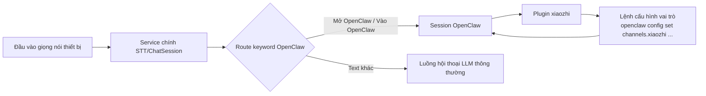

# Hướng dẫn tích hợp OpenClaw

## Sơ đồ kiến trúc

## Bước cài đặt

1. Đảm bảo OpenClaw đã chạy bình thường.
2. Trong popup `Cài đặt OpenClaw` của agent, copy lệnh cấu hình vai trò; hệ thống sẽ tự điền WebSocket URL của service hiện tại và JWT token của agent đó.
3. Trong cấu hình vai trò của OpenClaw console, lần lượt chạy bốn lệnh sau:
   `openclaw config set channels.xiaozhi.enabled true --strict-json`
   `openclaw config set channels.xiaozhi.url "{url}"`
   `openclaw config set channels.xiaozhi.token "{token}"`
   `openclaw gateway restart`
4. Trong đó `{url}` và `{token}` cần thay bằng giá trị thực tế copy từ popup; cuối cùng chạy `openclaw gateway restart` để cấu hình có hiệu lực.

## Cách sử dụng

1. Trong popup `Cài đặt OpenClaw` của agent, nhấp “Copy lệnh”.
2. Trong cấu hình vai trò của OpenClaw console, chạy bốn lệnh đã copy để hoàn tất cấu hình `enabled`, `url`, `token` và restart gateway.
3. Sau khi cài đặt và cấu hình xong, có thể gọi năng lực plugin xiaozhi trong session OpenClaw.
4. Trong popup `Xem OpenClaw`, có thể dùng “Gửi test” để xác minh kết nối và phản hồi.
5. Phía thiết bị có thể dùng `mở OpenClaw` / `vào OpenClaw` để vào chế độ OpenClaw, dùng `đóng OpenClaw` / `thoát OpenClaw` để thoát chế độ.

## Gợi ý xử lý sự cố

- Trạng thái hiển thị chưa kết nối: xác nhận `channels.xiaozhi.url` và `channels.xiaozhi.token` đang dùng giá trị mới nhất, đồng thời `channels.xiaozhi.enabled` đã đặt thành `true`.
- Kiểm thử hội thoại timeout: kiểm tra bốn lệnh cấu hình vai trò đã chạy thành công chưa, URL/token có đúng không, đã chạy `openclaw gateway restart` chưa và session OpenClaw có online không.
