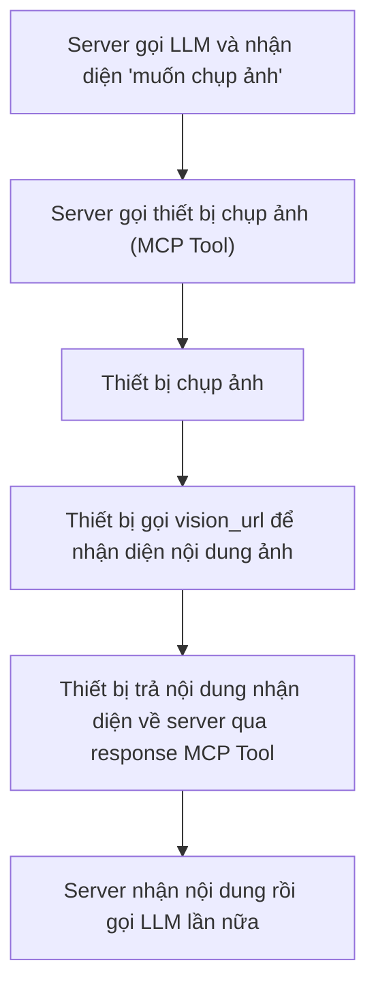

# Quy trình và mô tả cấu hình nhận diện thị giác

## 1. Giới thiệu chức năng

Hệ thống hỗ trợ chức năng nhận diện thị giác, chủ yếu thông qua gọi dịch vụ nhận diện thị giác bên ngoài (như Aliyun Qwen-VL, Volcengine Doubao Vision, v.v.) để thực hiện hiểu ảnh, nhận diện nội dung và các năng lực tương tự. Các tham số liên quan có thể điều chỉnh linh hoạt qua file cấu hình.

## 2. Vị trí file cấu hình

File cấu hình liên quan đến nhận diện thị giác nằm ở:

- `config/config.yaml`: file cấu hình chính, chứa các tham số liên quan đến `vision`.

## 3. Mô tả tham số chính

Ví dụ cấu hình `vision` trong `config/config.yaml`:

```yaml
vision:
  enable_auth: false
  vision_url: "http://192.168.208.214:8989/xiaozhi/api/vision"
  vllm:
    provider: "aliyun_vision"
    aliyun_vision:
      type: "openai"
      model_name: "qwen-vl-plus-latest"
      base_url: "https://dashscope.aliyuncs.com/compatible-mode/v1"
      api_key: "api_key"
      max_token: 500
    doubao_vision:
      type: "openai"
      model_name: "doubao-1.5-vision-lite-250315"
      api_key: "api_key"
      base_url: "https://ark.cn-beijing.volces.com/api/v3"
      max_tokens: 500
```

- `enable_auth`: có bật xác thực cho interface nhận diện thị giác hay không.
- `vision_url`: **địa chỉ HTTP trả về cho client để nhận diện ảnh**; client tải ảnh lên địa chỉ này và nhận kết quả nhận diện.
- `vllm.provider`: chỉ định dịch vụ nhận diện thị giác hiện dùng (như `aliyun_vision`, `doubao_vision`).
- `aliyun_vision`/`doubao_vision`: tham số kết nối của từng dịch vụ nhận diện thị giác, bao gồm:
  - `type`: kiểu API (như interface tương thích OpenAI).
  - `model_name`: tên model nhận diện thị giác sử dụng.
  - `base_url`: địa chỉ API service.
  - `api_key`: khóa truy cập service.
  - `max_token`/`max_tokens`: số token tối đa.

## 4. Quy trình cấu hình

1. Chọn và đăng ký dịch vụ nhận diện thị giác cần dùng theo nhu cầu thực tế (như Aliyun, Volcengine Doubao, v.v.), lấy API Key.
2. Sửa `config/config.yaml`, điền `vision_url`, `provider` và tham số service tương ứng dưới trường `vision`.
3. Khởi động service, kiểm tra log để xác nhận module nhận diện thị giác đã load thành công.
4. Tải ảnh lên qua API hoặc trang frontend để xác minh hiệu quả nhận diện.

## 5. Câu hỏi thường gặp và xử lý sự cố

- **Truy cập interface thất bại**: kiểm tra `vision_url` có đúng không, service đã khởi động chưa.
- **Xác thực thất bại**: nếu bật xác thực, cần kiểm tra `api_key` có đúng và còn hiệu lực không.
- **Kết quả nhận diện bất thường**: xác nhận provider và tên model điền đúng, API Key còn hiệu lực, service bên ngoài khả dụng.

---

Nếu cần bổ sung cách gọi API cụ thể, mô tả tích hợp frontend hoặc cấu hình của dịch vụ nhận diện thị giác cụ thể, hãy liên hệ developer.

## 6. Các bước luồng điển hình và flowchart

### Mô tả bước

1. Server gọi LLM và nhận diện ý định người dùng là “muốn chụp ảnh”.
2. Server gửi lệnh chụp ảnh xuống thiết bị qua MCP Tool.
3. Thiết bị nhận lệnh rồi chụp ảnh.
4. Thiết bị dùng `vision_url` để nhận diện nội dung ảnh đã chụp.
5. Thiết bị trả nội dung ảnh nhận diện được về server dưới dạng response của MCP Tool.
6. Sau khi server nhận được kết quả chụp ảnh và nhận diện, có thể gọi LLM lần nữa để xử lý tiếp.

### Flowchart


